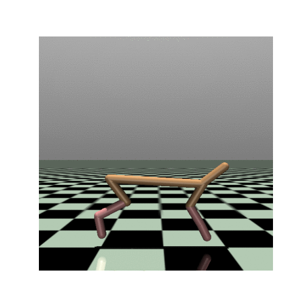
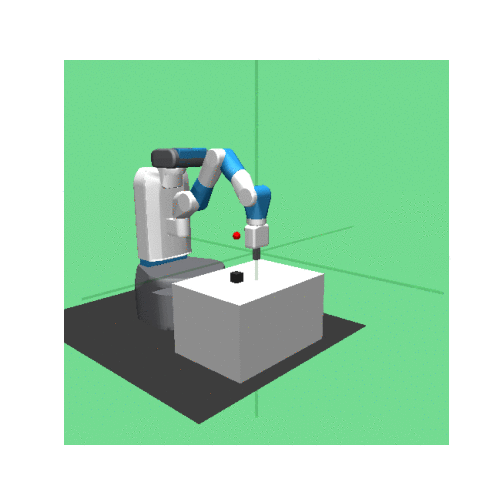
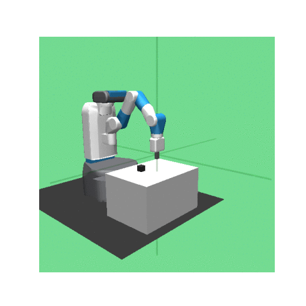

# reinforcement_learning_TD3-HER
## Abstract 
The project consists in the implementation of TD3 algorithm and the use of HER method in
order to train a robot to perform pick and place tasks. The project development is
composed of three parts, TD3 implementation test, TD3+HER test on the simplest robot
environment and then the use of TD3+HER to solve the target task.

## TD3 - HalfCheetah-v1 environment

## TD3+HER - FetchReach-v1 environment

## TD3+HER - FetchPickAndPlace-v1 environment

